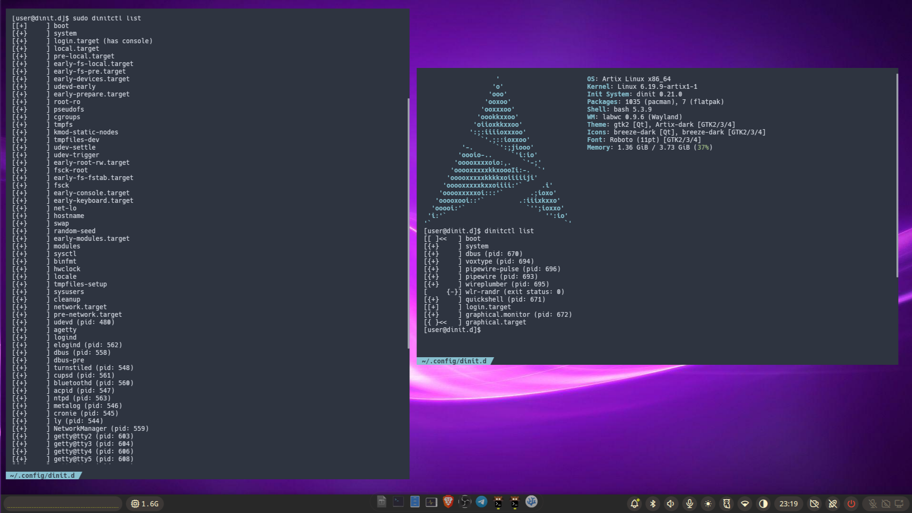

# Artix dinit labwc noctalia minimal config

A systemd-free minimalist Linux desktop setup using **dinit** init, **labwc** compositor, and **Noctalia** (Quickshell) desktop environment on **Artix Linux**.



## Overview

This configuration provides a beautiful, lightweight Wayland desktop environment without systemd, using:

- **Init**: dinit (with turnstile for user sessions)
- **Display Manager**: ly (TUI-based)
- **Compositor**: labwc (Openbox-compatible)
- **Desktop Shell**: Noctalia (Quickshell)
- **Audio**: PipeWire + WirePlumber
- **Session**: elogind + turnstile

NB: `/home/user` is hardcoded probably you should replace it with your user path.

NB2: `wlr-randr` is one shot, it doesn't need to stay active in the background. it is useful to scale the display  resolution.
MB3: systemd user session added mainly for reference

## Quick Start

### Installation

1. Install required packages:
   ```bash
   sudo pacman -S dinit turnstile elogind labwc wlroots pipewire pipewire-pulse wireplumber xdg-desktop-portal-wlr xdg-desktop-portal-gtk grim slurp wlsunset quickshell noctalia bluez bluez-utils
   ```

2. Install dinit service scripts (system services):
   ```bash
   sudo pacman -S pipewire-dinit wireplumber-dinit
   ```

3. Copy configuration files:
   - Copy `.config/` to `~/.config/` (backup existing labwc config first)
   - Copy `ly/` to `/etc/ly` (or use `ly/setup.sh`)

4. Configure PAM for turnstile:
   Ensure `/etc/pam.d/ly` and `/etc/pam.d/ly-autologin` contain:
   ```
   session optional pam_turnstile.so
   session optional pam_elogind.so
   ```

5. Free a console for ly (if needed):
   Edit `/etc/dinit.c/config/console.conf`:
   ```
   ACTIVE_CONSOLES="/dev/tty[2-6]"
   ```

6. Reboot and select "labwc" session in ly

## Architecture

### Service Management

User services are managed by dinit via turnstile. The dependency chain is:

```
dbus → quickshell (Noctalia) → wlr-randr
```

System services (pipewire, wireplumber, etc.) run under system dinit.

Check service status:
```bash
dinitctl list                    # System services
dinitctl --user list             # User services
dinitctl catlog <service>        # View logs
```

Example output:
```
[user@dinit.d]$ dinitctl list
[[ ]<<   ] boot
[{+}     ] system
[{+}     ] dbus (pid: 670)
[{+}     ] voxtype (pid: 694)
[{+}     ] pipewire-pulse (pid: 696)
[{+}     ] pipewire (pid: 693)
[{+}     ] wireplumber (pid: 695)
[     {-}] wlr-randr (exit status: 0)
[{+}     ] quickshell (pid: 671)
[[+]     ] login.target
[{+}     ] graphical.monitor (pid: 672)
[{+}     ] graphical.target
```

### Environment Variables

User dinit services do NOT inherit the full user environment. Use `env-file` in service definitions.

**User dinit environment** (`~/.config/dinit.d/environment`):
```bash
XDG_CURRENT_DESKTOP=labwc
XDG_SESSION_TYPE=wayland
XDG_SESSION_DESKTOP=labwc
XDG_RUNTIME_DIR=/run/user/1000
XDG_DATA_DIRS=/home/user/.local/share/flatpak/exports/share:/var/lib/flatpak/exports/share:/usr/local/share:/usr/share
XDG_CONFIG_HOME=/home/user/.config
WAYLAND_DISPLAY=wayland-0
QT_QPA_PLATFORM=wayland
QT_QPA_PLATFORMTHEME=qt6ct
DISPLAY=:0
```

**Session environment** (`~/.config/labwc/environment`):
```bash
XDG_CONFIG_HOME=/home/user/.config
QT_QPA_PLATFORMTHEME=qt6ct
XCURSOR_THEME=Adwaita
XCURSOR_SIZE=32
XKB_DEFAULT_LAYOUT=en
XKB_DEFAULT_OPTIONS=compose:caps
```

## Configuration Files

| Path | Purpose |
|------|---------|
| `~/.config/dinit.d/` | User service definitions |
| `~/.config/labwc/rc.xml` | labwc keybinds and config |
| `~/.config/labwc/environment` | Session environment variables |
| `~/.config/noctalia/settings.json` | Noctalia wallpaper and settings |
| `/etc/pam.d/ly`, `/etc/pam.d/ly-autologin` | PAM config for turnstile |
| `/etc/elogind/logind.conf.d/` | Power/lid/sleep settings |

## Features

### Audio Control

- Volume: `wpctl set-volume @DEFAULT_AUDIO_SINK@ 5%+`
- Noctalia OSD via IPC:
  ```bash
  qs -c noctalia-shell ipc --any-display call volume increase
  qs -c noctalia-shell ipc --any-display call volume decrease
  qs -c noctalia-shell ipc --any-display call volume muteOutput
  qs -c noctalia-shell ipc --any-display call volume muteInput
  ```
- Keybinds configured in `~/.config/labwc/rc.xml`

### Screenshots

```bash
grim -g "$(slurp)" ~/Pictures/screenshot-$(Y%m%d-%H%M%S).png
```

### Night Light

```bash
wlsunset -S 07:30 -s 18:30 -t 3500 -T 6500 &
```

### Wallpaper

Edit `~/.config/noctalia/settings.json`:
```json
{
  "enableMultiMonitorDirectories": true,
  "monitorDirectories": [
    {
      "directory": "/home/user/Pictures/Wallpapers",
      "name": "eDP-1",
      "wallpaper": "/home/user/Pictures/Wallpapers/image.jpg"
    }
  ]
}
```

Restart Noctalia: `pkill -f "qs -c"; qs -c noctalia-shell &`

### Bluetooth

```bash
sudo dinitctl start bluetoothd           # Start service
sudo dinitctl status bluetoothd         # Check status
bluetoothctl                            # Pair devices (from bluez-utils)
```

### Power Management

Set power button to suspend:
```bash
echo '[Login]
HandlePowerKey=suspend' | sudo tee /etc/elogind/logind.conf.d/power-button.conf
```

Restart elogind:
```bash
sudo dinitctl stop logind
sudo dinitctl stop elogind
sudo dinitctl start elogind
sudo dinitctl start logind
```

## Troubleshooting

| Issue | Solution |
|-------|----------|
| Socket missing | `pgrep turnstiled`, check `/run/turnstiled/1000/` |
| Missing boot dir | `sudo mkdir -p /usr/lib/dinit.d/user/boot.d` |
| Service restarting | `dinitctl catlog <service>` |
| Orphaned process | Kill manually, then `dinitctl --user start <service>` |
| polkit failing | Unload: `dinitctl --user unload polkit` (runs via D-Bus activation) |
| "failed to connect to display" | Check `ls -la /run/user/1000/wayland-*` and `pgrep labwc` |
| IPC/Super+Space not working | Use `--any-display` flag with `qs` commands |

## Autostart Locations

1. `~/.config/dinit.d/` — Daemons (dbus, pipewire, etc.)
2. `~/.config/labwc/autostart` — Compositor-specific autostart
3. `~/.config/autostart/` — XDG autostart (generally keep disabled)

## Useful Commands

```bash
loginctl suspend                    # Suspend system
xdg-user-dirs-update               # Update user directories
dinitctl --user reload <service>   # Reload user service
```

## Notes

- **Do NOT** `kill -HUP` user dinit — it loses track of processes
- Use `log-type = buffer` in user services to enable `dinitctl catlog` for debugging
- Labwc is started by ly (display manager), not by dinit
- Quickshell/Noctalia comes from AUR

## References

- [AGENTS.md](AGENTS.md) — Detailed configuration reference for LLM agents
- [Artix Linux](https://artixlinux.org/)
- [dinit](https://github.com/davidstrauss/dinit)
- [labwc](https://labwc.github.io/)
- [quickshell](https://github.com/lenarttodur/quickshell)
- [Noctalia](https://github.com/lenarttodur/noctalia)
